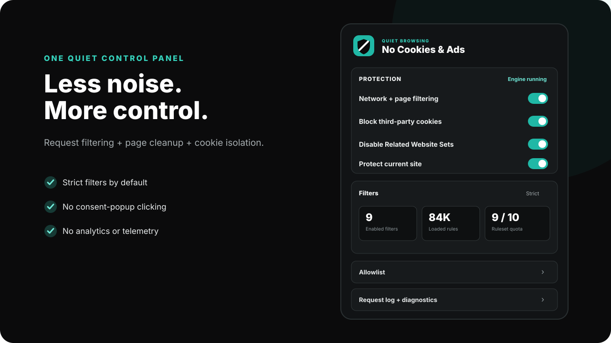

<p align="center">
  
</p>

<p align="center">
  <a href="https://github.com/Majkey25/no-cookies-ads/releases/latest/download/no-cookies-ads.zip"></a>
  
</p>

<p align="center">
  <a href="https://github.com/Majkey25/no-cookies-ads/actions/workflows/ci.yml"></a>
  <a href="https://github.com/Majkey25/no-cookies-ads/releases"></a>
  <a href="LICENSE"></a>
  
</p>

# No Cookies & Ads

Quiet browsing in one Chrome extension. It blocks ads and trackers at the browser request layer, removes page-level advertising and cookie-consent clutter, and asks Chrome to block third-party cookies.

**[Download the latest extension ZIP](https://github.com/Majkey25/no-cookies-ads/releases/latest/download/no-cookies-ads.zip)**

<p align="center">
  
</p>

## Protection

- AdGuard MV3 network filtering for ads, tracking, URL tracking, and malicious requests.
- Cosmetic filtering for page ads, overlays, cookie notices, popups, widgets, and other annoyances.
- Chrome third-party-cookie blocking.
- Related Website Sets disabled by default to preserve cookie isolation.
- Strict filter preset enabled by default: Base, Tracking Protection, URL Tracking, Cookie Notices, Popups, Mobile App Banners, Other Annoyances, Widgets, and Czech/Slovak regional coverage.
- Site allowlist, custom user rules, element blocker, diagnostics, and a bounded request log.
- No analytics, no telemetry, no account, and no remote executable code.

The extension does not open unsolicited tabs, windows, or consent popups. Cookie banners are hidden by packaged filtering rules; it does not click **Accept** for you.

## Cookie strategy

Cookie protection uses two layers:

1. Chrome's `privacy.websites` controls block third-party cookies and disable Related Website Sets when Chrome permits the extension to control them.
2. AdGuard Cookie Notices and annoyances filters remove consent banners and overlays from pages.

The popup reports when a browser policy, another extension, or the current Chrome build prevents a privacy setting from being controlled. Disabling a privacy toggle clears only this extension's override and restores the browser default.

## Scope boundary

Filtering covers browser traffic that Chrome exposes to Manifest V3 extensions. This is not device-wide DNS blocking, a VPN, a proxy, or a firewall. Apps and devices outside Chrome are not filtered.

## Install

1. Open [Releases](https://github.com/Majkey25/no-cookies-ads/releases/latest).
2. Under **Assets**, download `no-cookies-ads.zip`.
3. Extract it.
4. Open `chrome://extensions`.
5. Enable **Developer mode**.
6. Select **Load unpacked**.
7. Choose the extracted folder containing `manifest.json` and `background.js`.

Use the release asset, not GitHub's automatically generated source archive. The release build contains generated AdGuard rules and browser bundles.

## Controls

- **Network + page filtering** -> master filtering switch.
- **Block third-party cookies** -> Chrome privacy override.
- **Disable Related Website Sets** -> prevents related-site cookie exceptions.
- **Protect current site** -> quickly allow or protect the active site.
- **Filters** -> Minimal / Recommended / Strict presets or manual selection.
- **Allowlist** -> one domain per line.
- **User rules** -> custom AdGuard filtering rules.
- **Element blocker** -> select and hide a page element.
- **Request log** -> most recent 200 blocked requests, held only in memory.

## Permissions

| Permission | Why it is required |
|---|---|
| `<all_urls>` | Apply request and cosmetic filtering on visited pages. |
| `declarativeNetRequest` + feedback | Load packaged rules and show blocked-request diagnostics. |
| `privacy` | Control third-party cookies and Related Website Sets. |
| `storage` + `unlimitedStorage` | Store settings, filter state, allowlist, and custom rules. |
| `tabs` + `webNavigation` + `scripting` | Current-site controls, document blocking, and the element blocker. |
| `webRequest` | Supply request context required by the AdGuard MV3 engine. |

## Development

Requires Node.js 22 or newer.

```bash
npm install
npm test
npm run build
npm run package
```

Build output -> `dist/extension`

Release archives -> `dist/release/no-cookies-ads.zip` + versioned ZIP

## Credits and license

The filtering engine, ruleset tooling, Assistant, and packaged filter assets come from [AdGuard](https://github.com/AdguardTeam). See [NOTICE.md](NOTICE.md).

Licensed under [GPL-3.0-only](LICENSE).
